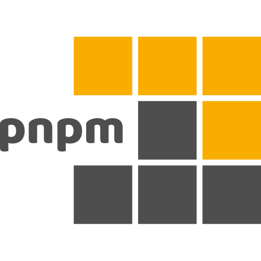
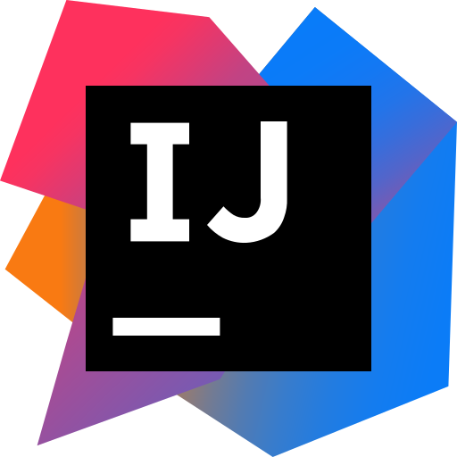

<h1 align="center">Hi there, I'm Alexander </h1>

+380 67 123 4567 | <a href="mailto:gavrylovalexandr@gmail.com">alexaaandrrre2024@gmail.com</a> | <a href="https://alexgavrylov.vercel.app">Portfolio</a> | <a href="https://drive.google.com/file/d/18oZMgSG6pd5j5AOaxJlrkuW1sZWsToC4/view?usp=sharing">Resume/CV</a> | Telegram: <a href="https://t.me/Aleksandr3l2">Aleksandr3l2</a> | Discord: <a href="/">alex_kiim</a>

<link rel="stylesheet" href="https://cdn.jsdelivr.net/gh/dheereshag/coloured-icons@1.9.6/app/ci.min.css" />
<link rel="stylesheet" href="https://cdn.jsdelivr.net/gh/dheereshag/coloured-icons@master/app/ci.min.css" />

  
  &nbsp;
  
  &nbsp;
  
  &nbsp;
  
  &nbsp;
  
  &nbsp;
  
  &nbsp;
  
  &nbsp;
  
  &nbsp;
  
  &nbsp;
  
  &nbsp;
  
  &nbsp;
  

 
 

**👨‍💻 Full-Stack Developer | Computer Science Student**

**Alexander Gavrylov** — Software Engineer specializing in full-stack web development with production-ready applications currently serving real users.

### 🎯 Core Expertise

- **Technical Skills:** JavaScript, TypeScript, HTML, CSS, SQL
- **Libraries:** React, Next.js, Redux, TailwindCSS
- **Frameworks:** Express.js, NestJS
- **Developer Tools:** Git, Docker, GitHub Actions, Postman
- **Platforms:** AWS, Azure, Vercel, Netlify

### 🌍 Languages

- 🇺🇦 **Ukrainian** — Native
- 🇷🇺 **Russian** — Native
- 🇬🇧 **English** — B2 (Upper-Intermediate)
- 🇰🇷 **Korean** — Currently learning

# 💻 Technologies & Tools:

> Frontend Stack & Tools

  
  
  
  
  
  
  
  
  
  
  
  
  
  

> Backend Stack

  
  &nbsp;
  
  &nbsp;
  
  &nbsp;
  
  &nbsp;
  

> Programming Languages (Hands-on Experience)

  
  &nbsp;
  
  &nbsp;
  
  &nbsp;
  
  &nbsp;
  
  &nbsp;
  
  &nbsp;
  

> Operation Systems

  
  &nbsp;
  

> Code Editors & IDEs

  
  &nbsp;
  
  &nbsp;
  
  &nbsp;
  
  &nbsp;
  
  &nbsp;
  

> Terminal & Shell

  
  &nbsp;
  
  &nbsp;
  

> DevOps & Cloud Infrastructure

  

> Productivity & Management

  
  &nbsp;
  
  &nbsp;
  
  &nbsp;
  

 
 

# Education & Certifications

| 🏢 **National University «Odessa Polytechnic»**                                          | 🧑‍💻 **Hillel IT School**                                                                                                                                             |
| ---------------------------------------------------------------------------------------- | ------------------------------------------------------------------------------------------------------------------------------------------------------------------- |
| [LinkedIn Page](https://www.linkedin.com/school/odessa-national-polytechnic-university/) | [LinkedIn Page](https://www.linkedin.com/school/odessa-national-polytechnic-university/)                                                                            |
| **Bachelor of Science in "Computer Science"**   1 September 2024 – June 2027          | **Certifications:**   [Front-end Level 1](https://certificate.ithillel.ua/view/99898576)   [Front-end Level 2](https://certificate.ithillel.ua/view/77626275) |
| [📍 University Website📍 ](https://op.edu.ua/)                                           | [📍 IT School Website📍 ](https://ithillel.ua/)                                                                                                                     |

# 🏫 University Repositories

<table>
  <colgroup>
    <col style="width: 40%;" />
    <col style="width: 40%;" />
    <col style="width: 20%;" />
  </colgroup>
  <thead>
    <tr>
      <th>Title</th>
      <th>Description</th>
      <th>Stars</th>
    </tr>
  </thead>
  <tbody>
    <tr>
      <td><a href="https://github.com/AlexKim71/IoT/tree/main">IoT</a></td>
      <td>Internet of Things practical projects and sensor integrations</td>
      <td>⭐ 8</td>
    </tr>
    <tr>
      <td><a href="https://github.com/AlexKim71/DBMS">DBMS</a></td>
      <td>Database Management Systems coursework with SQL implementations</td>
      <td>⭐ 12</td>
    </tr>
    <tr>
      <td><a href="https://github.com/AlexKim71/OOP">OOP</a></td>
      <td>Object-Oriented Programming concepts and design patterns</td>
      <td>⭐ 15</td>
    </tr>
    <tr>
      <td><a href="https://github.com/AlexKim71/Operating-Systems">Operating Systems</a></td>
      <td>Operating Systems course materials and practical assignments</td>
      <td>⭐ 10</td>
    </tr>
    <tr>
      <td><a href="https://github.com/AlexKim71/university_programming-works">Algorithmization and Programming</a></td>
      <td>Programming fundamentals and algorithmic problem solving</td>
      <td>⭐ 18</td>
    </tr>
    <tr>
      <td><a href="https://github.com/AlexKim71/Theory-of-Algorithms">Theory of Algorithms</a></td>
      <td>Algorithm theory implementations and complexity analysis</td>
      <td>⭐ 9</td>
    </tr>
  </tbody>
</table>

# 📂 Public Repositories

<table>
  <colgroup>
    <col style="width: 40%;" />
    <col style="width: 40%;" />
    <col style="width: 20%;" />
  </colgroup>
  <thead>
    <tr>
      <th>Title</th>
      <th>Description</th>
      <th>Stars</th>
    </tr>
  </thead>
  <tbody>
    <tr>
      <td><a href="https://github.com/AlexKim71/Wallpapers-Hub">🎨 Wallpapers Hub</a></td>
      <td>High-resolution wallpaper collection with categorized themes for desktop and mobile customization</td>
      <td>⭐ 45</td>
    </tr>
    <tr>
      <td><a href="https://github.com/AlexKim71/Dotfiles-Collections">⚙️ Dotfiles Setup</a></td>
      <td>Personal development environment configs including Zsh, Vim, Git settings with quick setup scripts</td>
      <td>⭐ 32</td>
    </tr>
    <tr>
      <td><a href="https://github.com/AlexKim71/Programming-Fonts.git">⌨️ Programming Fonts</a></td>
      <td>Premium monospaced fonts collection featuring Fira Code, JetBrains Mono with ligature support</td>
      <td>⭐ 27</td>
    </tr>
  </tbody>
</table>

<h3 align="center">💬 Ask me about anything <a href="https://www.tiktok.com/@aleksandrk1m">here</a></h3>

 
 

# 📊 GitHub activity statistics

# 📈 GitHub activity chart

# 🔝 Top Contributed Repos & Streak

<table>
  <tr>
    <td>
      
    </td>
    <td>
      
    </td>
  </tr>
</table>

# 🏆 GitHub Trophies

  

# Developer Fun Corner

<table>
  <tr>
    <td>
      
    </td>
    <td>
      
    </td>
  </tr>
</table>

# 💰 You can help me by Donating

<picture>
  <source media="(prefers-color-scheme: dark)" srcset="https://raw.githubusercontent.com/AlexKim71/AlexKim71/output/pacman-contribution-graph-dark.svg">
  <source media="(prefers-color-scheme: light)" srcset="https://raw.githubusercontent.com/AlexKim71/AlexKim71/output/pacman-contribution-graph.svg">
  
</picture>

  

